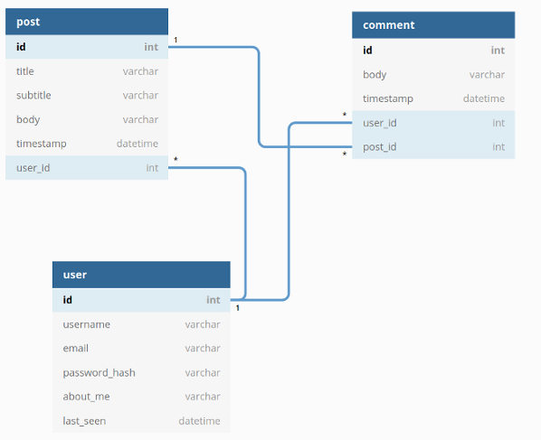

# flask-blog
This is just a simple blog built using the flask framework. The goal of this project is for me to practice full-stack integration and learn a new framework in the process.

---

## Setup for local use
First is package installation
```bash
$ pip3 install venv
$ source venv/bin/activate
(venv) $ pip3 install flask
(venv) $ pip3 install flask-login
(venv) $ pip3 install flask-wtf
(venv) $ pip3 install flask-migrate
(venv) $ pip3 install flask-bootstrap
(venv) $ pip3 install flask-moment
(venv) $ pip3 install Werkzeug
```

Next all you need to do is run the next command and the app is live, navigate to the indicated port on localhost and you should see the home page!
```bash
(venv) $ flask run
 * Serving Flask app "flask-blog.py"
 * Environment: production
   WARNING: This is a development server. Do not use it in a production deployment.
   Use a production WSGI server instead.
 * Debug mode: off
[2020-02-26 22:15:20,484] INFO in __init__: Flask-blog startup
 * Running on http://127.0.0.1:5000/ (Press CTRL+C to quit)
```

To run in debug mode simply and re-run the app again
```bash
export FLASK_DEBUG=1
```

---

## Database Design



## Important Packages/Aspects of Flask

### Jinja2
> Jinja2 is a full-featured template engine for Python. It has full unicode support, an optional integrated sandboxed execution environment, widely used and BSD licensed.


I am using [Jinja2](http://jinja.pocoo.org/) template engine to help with producing the HTML pages at runtime by filling in the ```{{ ... }}``` blocks with proper values from the ```render_template()``` as well as handling conditional

```python
from flask import render_template
    render_template('index.html', title='Home', user=user)
```
### Flask-WTF (unfortunate name)
> Simple integration of Flask and WTForms, including CSRF, file upload, and reCAPTCHA.
I am using Flask-WTF as it is a simple wrapper around the WTForms package to better integrate it with flask. This is my main way of collecting input from users to add content to my blog.

*Also as a bonus this package protects against CSRF [Cross-Site Request Forgery](http://en.wikipedia.org/wiki/Cross-site_request_forgery) which is a malicious web attack that I didn't realize was a big issue and the SECRET_KEY created in the config file is what ensures safety (assuming I add ```form.hidden_tag()``` to each form I use).*

### Flask-SQLAlchemy
> Flask-SQLAlchemy is an extension for Flask that adds support for SQLAlchemy to your application. It aims to simplify using SQLAlchemy with Flask by providing useful defaults and extra helpers that make it easier to accomplish common tasks.

[Flask-SQLAlchemy](https://flask-sqlalchemy.palletsprojects.com/en/2.x/) is a wrapper for SQLAlchemy to make it more flask friendly

### SQLite
For simplicity (and since I am not deploying this anywhere) I decided to go with a SQLite database so I don't have to worry about hosting a server. The nice thing is that Flask-SQLAlchemy works with SQLite and many other DB engines so when the time comes I could just port the data over to a proper server (like PostgreSql for example).

### Flask-Migrate
> This extension is a Flask wrapper for Alembic, a database migration framework for SQLAlchemy. Working with database migrations adds a bit of work to get a database started, but that is a small price to pay for a robust way to make changes to your database in the future.
I went with a migration tool because I may want to make changes to the DB structure later and this ensures that it will make my life easier down the line. It is essentially a version control for source code but used for databases, where the data is maintained through structural changes.

To adjust the database you need three commands...
```bash
(venv) $ flask db migrate -m "message"
(venv) $ flask db upgrade
(venv) $ flask db downgrade
```
"migrate" is used to stage changes to the database design and generate the migration script. "upgrade" is used to actually run the migration script. This puts the changes into effect. And "downgrade" us used to undo the last migration, which allows a rollback if something was done incorrectly.


### Werkzeug

[Werkzeug](https://palletsprojects.com/p/werkzeug/) package for password hashing to ensure some level of security for my users. Also used for url parsing to return to the previous page if redirected to login

### Flask-Login

[Flask-Login](https://flask-login.readthedocs.io/en/latest/) is being used so that I can track user states and maintain some level of control of users being logged in vs. out.

### File logging

I included support for file logging, this way if errors are encountered during normal running (not in debug mode) they are stored in a file. I decided to go with a max size of 10kb per file and 10 versions of the log at a time.

### Flask-Bootstrap

Used to apply bootstrap style formatting to the jinja rendered elements of the website.
*Important to note that this uses bootstrap 3.3, not the new version 4*

### Flask-Moment

Used to convert the UTC times stored in the database into the appropriate format for the user viewing the page.